# Trabajo Práctico N°5: Drivers de Dispositivos  
**GrupoNotFound**  
**REYEROS, Marcos Agustín**

**CISNEROS, Tomás Alejo**

## Introducción General y Contextualización del TP

En el marco de este trabajo se aborda el desarrollo de un **Character Device Driver (CDD)**, una pieza fundamental del sistema operativo que permite controlar dispositivos que operan con flujos de datos byte a byte. Un *driver*, en general, es un software que administra, conduce y coordina el funcionamiento de un dispositivo determinado. En Linux, estos drivers pueden clasificarse según el tipo de dato que gestionan (carácter, bloque, red) y el nivel de interacción con el hardware (drivers de dispositivo, drivers de bus, controladores físicos).

Particularmente, el CDD se encarga de facilitar la comunicación entre el sistema y dispositivos periféricos como teclados, puertos seriales, sensores o cámaras, permitiendo operaciones de lectura, escritura y control a través de interfaces expuestas en el espacio de usuario mediante archivos especiales ubicados en `/dev`.

El desarrollo de un driver implica comprender conceptos como:
- El modelo de capas entre **aplicación ↔ archivo de dispositivo ↔ driver ↔ hardware**.
- El uso de los números `major` y `minor` para vincular un archivo del sistema con el driver cargado.
- La separación entre espacio de usuario y espacio del kernel.
- El manejo de funciones estándar del kernel (`open`, `read`, `write`, `ioctl`, `release`).
- La creación de módulos mediante `insmod`/`rmmod` y su instrumentación con `dmesg`.

Además, se revisan contribuciones históricas como las de **Werner Almesberger**, desarrollador del soporte FAT para Linux, y se destacan distinciones clave entre:
- *Device driver* (software).
- *Device controller* (hardware).
- *Bus driver* (interfaz entre protocolos de comunicación y el kernel).

---

## Enunciado del TP y Desafío Propuesto

En este trabajo práctico se propone construir un **Character Device Driver** en Linux que permita sensar dos señales externas con un período de **1 segundo** cada una. El sistema debe cumplir los siguientes requerimientos:

- La aplicación de usuario debe poder **seleccionar cuál de las dos señales quiere leer**.
- Los datos de la señal seleccionada deben **graficarse en tiempo real**, representando:
  - En el eje X: el tiempo.
  - En el eje Y: el valor de la señal sensada.
- El gráfico debe **resetearse automáticamente al cambiar de señal**.
- Las **correcciones de escala** necesarias se deben realizar desde la aplicación de usuario.
- El driver debe operar en tiempo real, garantizando una lectura estable y coherente de los valores.

El sistema puede desarrollarse y probarse sobre una **Raspberry Pi**, accediendo a las señales externas a través de puertos GPIO, o bien utilizando simuladores, en este trabajo se implementarón dos modos de trabajo, uno usando la **Raspberry Pi** y otro en un entorno totalmente simulado.

Este proyecto integra conocimientos sobre desarrollo de módulos del kernel, interfaces de dispositivos, programación en C de bajo nivel, y visualización de datos desde el espacio de usuario, constituyendo una instancia clave para comprender la interacción directa entre software y hardware en sistemas Linux.

# DESAFIO: Construcción de un CDD para Sensar Señales

### Primero habilitamos ssh de una raspberry pi 400


Nos conectamos desde la computadora con linux utilizada para realizar todos los Trabajos Practicos

### Instalación de Nmap

Se instaló la herramienta **Nmap** mediante el comando `sudo apt install nmap`.  
Nmap es una utilidad de línea de comandos utilizada para escanear redes y detectar dispositivos conectados, servicios abiertos y posibles vulnerabilidades. Resulta útil para conocer el estado de una red o equipo remoto, como en este caso, la Raspberry Pi.

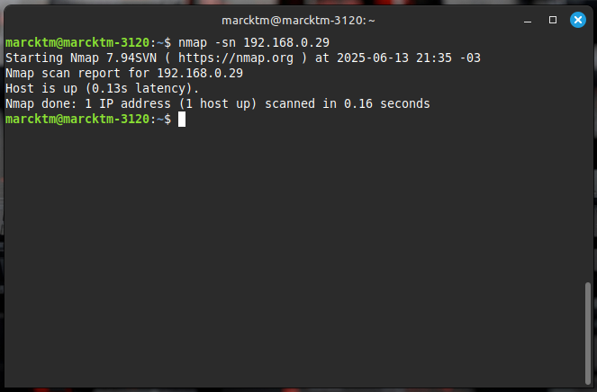

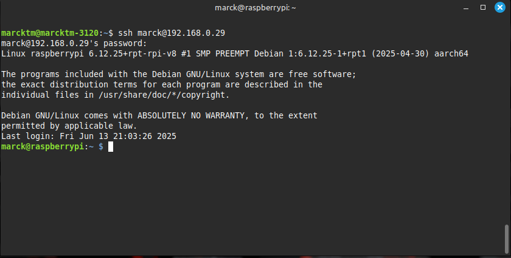

Pasamos el futuro repositorio a la raspberry pi 400 

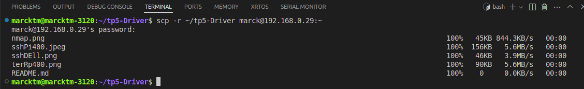

Usamos una esxtension de VSCode para trabajar tranquilos en el desarrollo del Driver para raspberry-pi

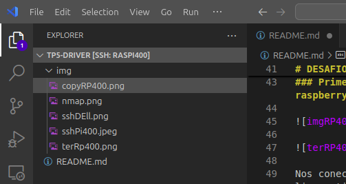


# Carpeta CDD

Desde Visual Studio Code con extensión SSH conectada a la Raspberry Pi 400, se creó la carpeta CDD dentro del proyecto. Allí se colocó el archivo `signal_driver.c`, que contiene toda la lógica del módulo del kernel. A su vez, se generó el `Makefile` correspondiente para compilar el módulo de forma compatible con el kernel instalado en la Raspberry, este archivo permite compilar el archivo y generar un módulo del kernel llamado `signal_driver.ko`, listo para ser insertado con `insmod`.

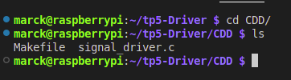

Compilamos `signal_driver.c`

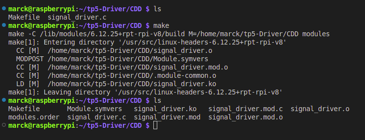

# Detalles

Durante el desarrollo del CDD signal_driver.c, al compilar correctamente el módulo signal_driver.ko utilizando make, se intentó cargar dicho módulo al kernel de la Raspberry Pi con el siguiente comando.

```bash
sudo insmod signal_driver.ko
```
Inicialmente, el sistema arrojó.

```bash
insmod: ERROR: could not insert module signal_driver.ko: Operation not permitted
```

### NO usamos GPIO en este caso

#### Problema actual:

 - Los pines físicos GPIO en Raspberry Pi (como el 23 o el 24) muchas veces ya están ocupados por otros controladores del sistema o incluso por la configuración de firmware.

 - Incluso si aparecen libres (/sys/kernel/debug/gpio), no necesariamente se pueden usar desde un módulo del kernel por conflictos con gpiod o con el device tree.

#### Solución:

 - Simulamos las señales directamente en el espacio de kernel usando un timer_list o kthread, sin tocar ningún GPIO real.

### Compilación del driver

Para compilar el archivo tp5_driver.c, se utilizó un Makefile estándar como se aprendió en clase y en los ejemplos, siguiendo la estructura.

```bash
  obj-m += signal_driver.o

all:
	make -C /lib/modules/$(shell uname -r)/build M=$(PWD) modules

clean:
	make -C /lib/modules/$(shell uname -r)/build M=$(PWD) clean

```

### Se cargo el Módulo

Utilizamos el siguiente comando una vez compilado 

```bash
sudo insmod signal_driver.ko
```

Verificamos con el siguiente comando
```bash
dmesg | tail
```

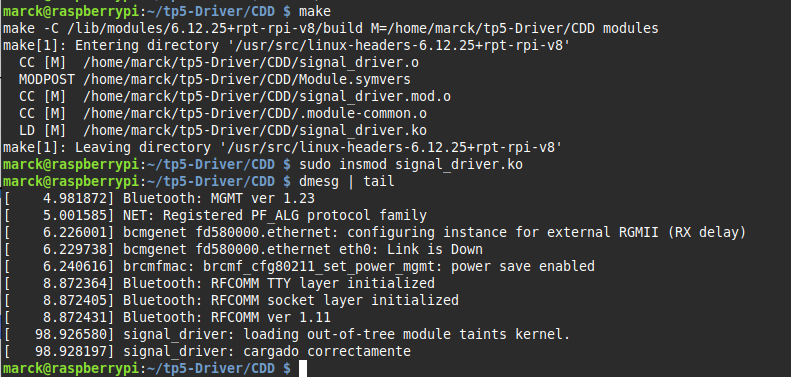

### Creación del archivo de dispositivo y permisos

El uso de class_create() y device_create() en el código, el sistema udev crea automáticamente el archivo.

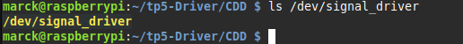

Se pdroa crear manualmente con

```bash
sudo mknod /dev/signal_driver c <major> 0
```
Obtenemos `<major>` con

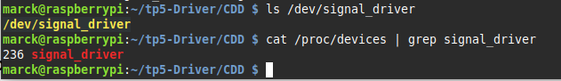

Debemos configurar permisos de lectura y escritura sobre el archivo para poder seleccionar la señal y observar su información a través de la aplicación en python de más adelante.

```bash
sudo chmod 666 /dev/signal_driver
```

Se prueba lectura y escritura del driver

```bash
echo 1 > /dev/signal_driver  # Activa señal cuadrada
cat /dev/signal_driver       # Muestra 0 o 1

echo 2 > /dev/signal_driver  # Activa señal triangular
cat /dev/signal_driver       # Muestra valor entre 0-100
```

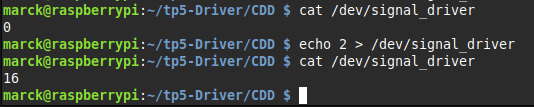

Se verifica via logs cada operación open, read, write, close.

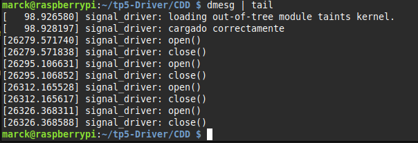

El driver fue correctamente compilado, cargado al kernel, y verificado desde consola mediante operaciones de lectura y escritura en el archivo especial ubicado en /dev/signal_driver. Se integró completamente al sistema de archivos virtual (VFS) y se lo expuso como un dispositivo de carácter funcional.

Este resultado confirma una implementación de un CDD autónomo y desacoplado del hardware, sirviendo como base para la próxima etapa del trabajo: `el desarrollo de una aplicación en espacio de usuario que se comunique con el driver, registre las señales y permita su visualización gráfica`.

---

LLegó el momento de ahondar un poco más en el codigo que contiene la logica del modulo de kernel, en este caso el `cdd_sim.c` que funciona similar al `signal_driver.c` solo que adaptado a un ambito de simulación para repasar un poco de los conceptos de CDD y como lo aplicamos a este trabajo.


---

### Definición de constantes

```c
#define DEVICE_NAME "cdd_signals"
#define CLASS_NAME "cdd_class"
```
Estas constantes definen el nombre simbólico del dispositivo y su clase en el sistema `/sys/class`, permitiendo que el dispositivo se exponga como un archivo en `/dev`. Esta es la forma estandarizada que tiene el **kernel de Linux** para conectar el driver con el espacio de usuario.

```c
#define IOCTL_SELECT_SIGNAL _IOW('a', 1, int)
```
El macro `_IOW` define un comando IOCTL para que el usuario pueda **controlar el comportamiento** del dispositivo mediante `ioctl(fd, cmd, arg)`. Encapsulando un mecanismo de control seguro entre espacio de usuario y kernel.

---

### Variables globales del dispositivo

```c
static dev_t dev_num;
```
`dev_t` representa el número de dispositivo que combina `major` (identificador del driver) y `minor` (identificador interno). El modelo de archivos de Linux asocia este número con archivos de dispositivo en `/dev`, permitiendo la **abstracción entre hardware y aplicaciones**.

```c
static struct class* cdd_class;
static struct cdev cdd_cdev;
```
- `cdd_class` permite registrar una clase de dispositivos, facilitando la creación de nodos en `/dev` automáticamente.
- `cdd_cdev` representa la estructura del kernel que define al Character Device.


---

### Control del dispositivo (IOCTL)

```c
static long cdd_ioctl(struct file *file, unsigned int cmd, unsigned long arg)
```
Permite enviar comandos al driver desde el espacio de usuario. Este mecanismo es clave para operaciones que no son simples lecturas o escrituras, como cambiar el tipo de señal.

```c
printk(KERN_INFO "CDD: señal cambiada a %d\n", current_signal);
```
`printk` es la herramienta de depuración principal en el espacio del kernel. Su salida es visible en `dmesg`, lo cual es vital para el seguimiento del comportamiento del driver.

---

### Registro de operaciones del dispositivo

```c
static struct file_operations fops = {
    .owner = THIS_MODULE,
    .open = cdd_open,
    .release = cdd_release,
    .read = cdd_read,
    .unlocked_ioctl = cdd_ioctl,
};
```
Asocia llamadas del sistema (`open`, `read`, `ioctl`) con funciones definidas por el driver. Esta estructura es lo que conecta el archivo `/dev/cdd_signals` con la lógica interna del kernel.

---

### Inicialización y creación del nodo de dispositivo

```c
alloc_chrdev_region(&dev_num, 0, 1, DEVICE_NAME);
```
Solicita al kernel un número mayor dinámicamente. Esto permite registrar el driver y enlazarlo con un archivo en `/dev`.

```c
cdev_init(&cdd_cdev, &fops);
cdev_add(&cdd_cdev, dev_num, 1);
```
Prepara y registra la estructura `cdev`, fundamental para que el kernel direccione las operaciones hacia el driver correcto.

```c
cdd_class = class_create(CLASS_NAME);
device_create(cdd_class, NULL, dev_num, NULL, DEVICE_NAME);
```
Permiten que aparezca automáticamente el archivo `/dev/cdd_signals`, haciendo disponible el driver para cualquier aplicación de usuario.

---

### Carga y descarga del módulo

```c
module_init(cdd_init);
module_exit(cdd_exit);
```
Indican al kernel qué funciones ejecutar al cargar y descargar el módulo (`insmod` / `rmmod`). Parte clave del desarrollo de módulos del kernel.


# Aplicación nivel de usuario

Instalamos librerías necesarias como `matplotlib` y desarrollamos `app_tp5.py`

Probamos la aplicación por terminal.

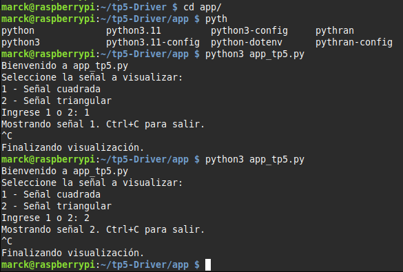

Se probo la aplicación en su primera version para esto nos pasamos a la raspberry pi 400 y probamos (Recordar que todo el manejo de archivos lo hacemos mediante SSH debido a la fluidez de la maquina)

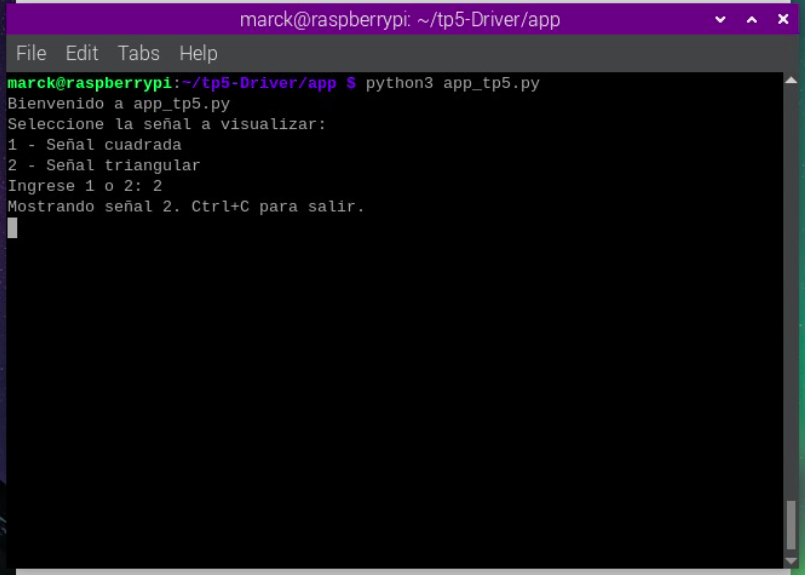
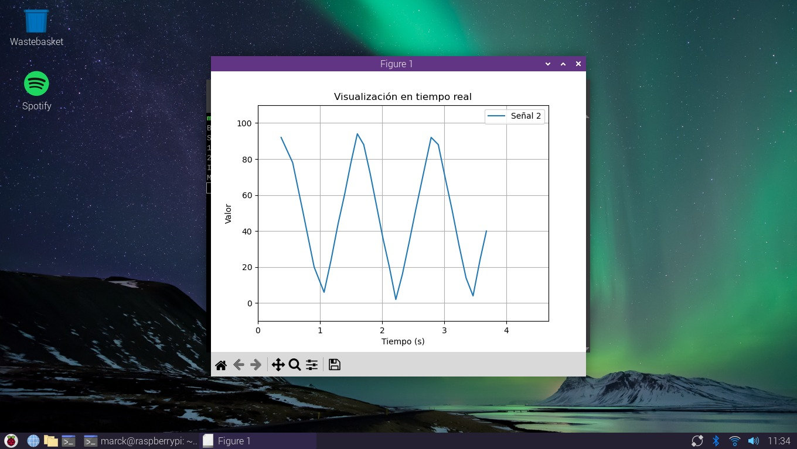
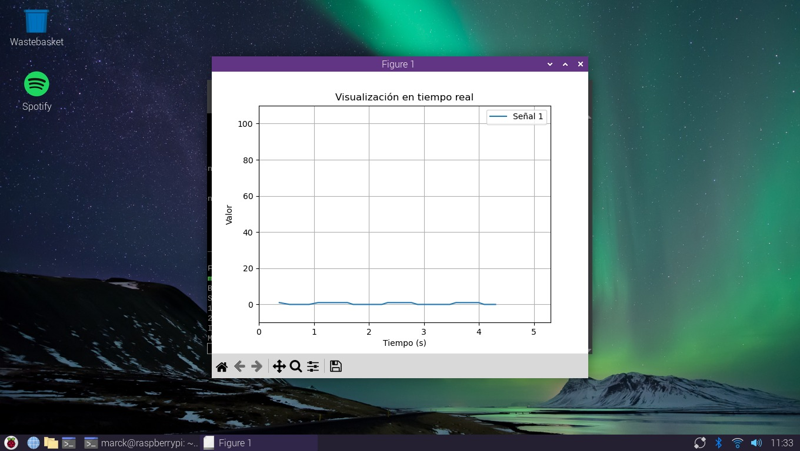


### 1ra Versión
```python
import time
import matplotlib.pyplot as plt

DEVICE_PATH = "/dev/signal_driver" 

def leer_valor():
    """Lee un valor desde el dispositivo"""
    try:
        with open(DEVICE_PATH, "r") as f:
            return int(f.read().strip())
    except Exception as e:
        print("Error al leer:", e)
        return 0

def cambiar_senal(signal_number):
    """Cambia la señal activa escribiendo al dispositivo"""
    try:
        with open(DEVICE_PATH, "w") as f:
            f.write(f"{signal_number}")
    except Exception as e:
        print("Error al cambiar señal:", e)

def main():
    print("Bienvenido a app_tp5.py")
    print("Seleccione la señal a visualizar:")
    print("1 - Señal cuadrada")
    print("2 - Señal triangular")

    opcion = input("Ingrese 1 o 2: ").strip()
    if opcion not in ['1', '2']:
        print("Opción inválida.")
        return

    cambiar_senal(opcion)
    print(f"Mostrando señal {opcion}. Ctrl+C para salir.")

    valores = []
    tiempos = []
    inicio = time.time()

    plt.ion()
    fig, ax = plt.subplots()
    linea, = ax.plot([], [], label=f"Señal {opcion}")

    # Ajuste de escala vertical según la señal
    if opcion == '1':
        ax.set_ylim(-0.5, 1.5)  # Para señal cuadrada
    else:
        ax.set_ylim(-10, 110)   # Para señal triangular

    ax.set_xlim(0, 30)
    ax.set_xlabel("Tiempo (s)")
    ax.set_ylabel("Valor")
    ax.set_title("Visualización en tiempo real")
    ax.grid()
    ax.legend()

    while True:
        try:
            val = leer_valor()
            t = time.time() - inicio
            valores.append(val)
            tiempos.append(t)

            # Mantener solo los últimos 100 valores
            if len(valores) > 100:
                valores.pop(0)
                tiempos.pop(0)

            linea.set_data(tiempos, valores)
            ax.set_xlim(max(0, t - 30), t + 1)
            plt.draw()
            plt.pause(0.1)

        except KeyboardInterrupt:
            print("\nFinalizando visualización.")
            break

if __name__ == "__main__":
    main()

```

Ahora corregimos los detalles para una app funcional en terminos de ver el funcionamiento completo, adaptando el codigo con las librerias y el funcionamiento necesario

## 🎬 Ver video de demostración
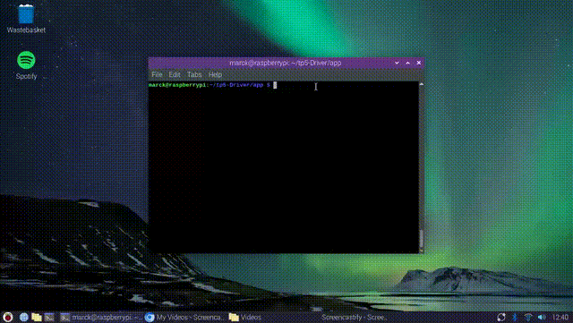

[📁 Descargar](img/tp5_driver.mp4)

##

## Conclusión
 
Este trabajo práctico permitió consolidar y aplicar de manera integrada los conocimientos adquiridos sobre el desarrollo de Drivers de Dispositivo en Linux, específicamente mediante la implementación de un Character Device Driver (CDD). A través del diseño y la construcción de un módulo cargable al kernel, se logró una solución funcional que permitió sensar señales simuladas en tiempo real y exponerlas al espacio de usuario mediante operaciones de lectura y escritura estándar sobre el archivo de dispositivo ubicado en /dev.

La experiencia evidenció la profundidad de la interacción entre espacio de usuario y espacio kernel, un pilar en la arquitectura de sistemas operativos modernos, permitiendo reforzar el entendimiento del modelo de capas, el uso de funciones como open, read, write y release, así como el manejo de estructuras como file_operations. La correcta configuración del archivo de dispositivo, la utilización de los números major y minor, y la validación a través de herramientas como dmesg, confirmaron la apropiada integración del módulo al subsistema VFS.

Por otro lado, se implementó una aplicación en Python que, desde el espacio de usuario, permitió controlar dinámicamente qué señal visualizar, logrando una interfaz clara y en tiempo real para representar los datos sensados. Esto destacó la importancia de construir herramientas que faciliten la interacción con los drivers sin recurrir a mecanismos complejos como memoria compartida o sockets, haciendo uso eficiente del sistema de archivos de Linux como canal de comunicación.

Además, el trabajo retoma y pone en práctica diversos conceptos abordados a lo largo de la cursada: desde la vinculación de lenguajes y la manipulación de archivos del sistema operativo, hasta la compilación cruzada de módulos del kernel, integrando saberes previos de otros trabajos prácticos. Si bien el uso de SSH no fue parte del contenido formal, se incorporó como una estrategia personal para trabajar de forma remota sobre la Raspberry Pi, optimizando los recursos de hardware y mostrando que el sistema desarrollado es flexible y aplicable incluso en entornos embebidos de baja potencia.

En definitiva, este TP representó una instancia integradora que permitió recorrer todas las capas del sistema Linux, desde el nivel más bajo del kernel hasta la interfaz de usuario, reafirmando la comprensión teórica sobre drivers, su clasificación, los desafíos de su implementación y la importancia de su correcta instrumentación para garantizar sistemas estables, reutilizables y seguros.
